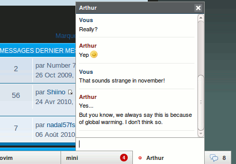

# Jappix Mini for YunoHost

Jappix Mini package for YunoHost. 
Mini XMPP chat website integration.

* [Mini Jappix website](https://mini.jappix.com/)
* [YunoHost website](https://yunohost.org/#/)



### Install app
```bash
sudo yunohost app install https://moul.re/repo/moul/jappix_mini_ynh
```

### DNS configuration
```bash
muc 1800 IN CNAME domain.tld. # For multi-user chat rooms
```
### Jappix Mini configuration
* [Jappix Mini Wiki configuration](https://github.com/jappix/jappix/wiki/JappixMini)
* [Jappix Mini tutorial configuration](https://mini.jappix.com/get)

### App state
App is **`notworking` and no more maintained**. jappix project is dead.

### Todo
* Use own Jappix Mini library, to avoid request to `jappix.com`: lib is no more retrievable as jappix.com is definitivly down.
* Use Yunohost instance's XMPP server instead of using `anonymous.jappix.com` for anonymous connexion: jappix.com is down.
* If possible, make Jappix Mini pluggable in every YunoHost web apps (HTML, PHP?) and to YunoHost SSO.
* Add on every YunoHost SSO users interfaces a chat room to permit discuss. Not very secure with credentials stocked on the web page.
* Backup, restore scripts?
